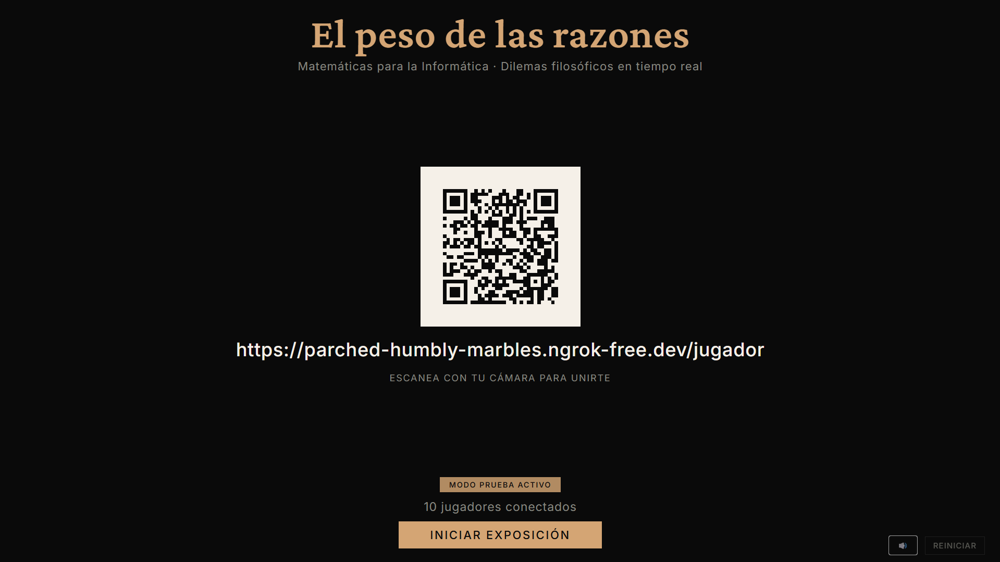
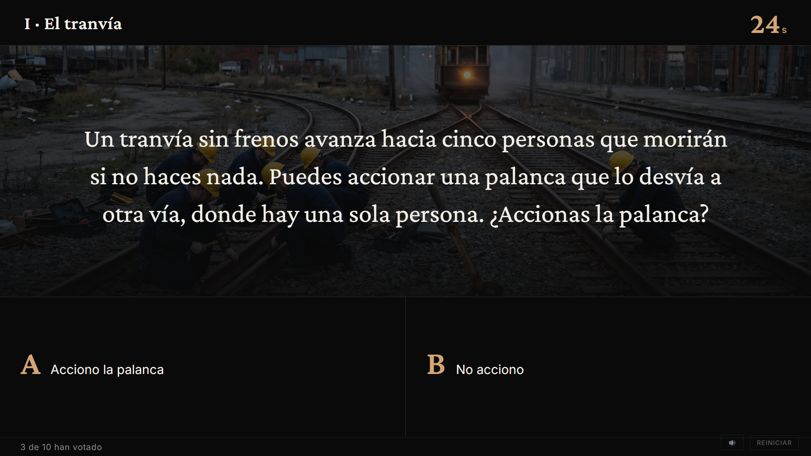
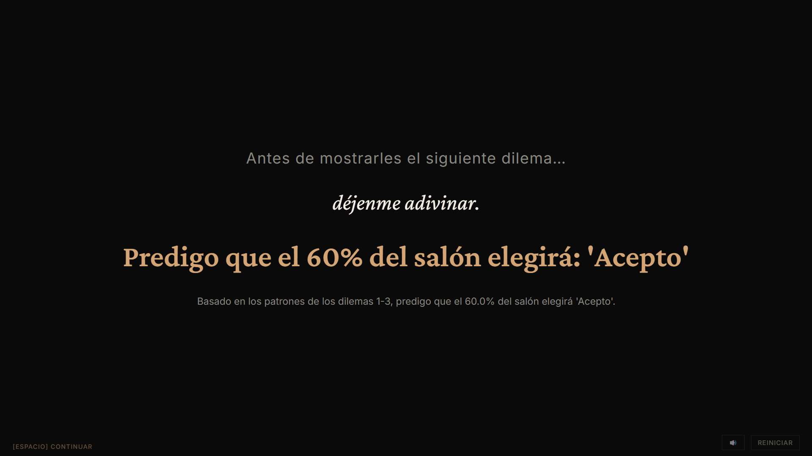
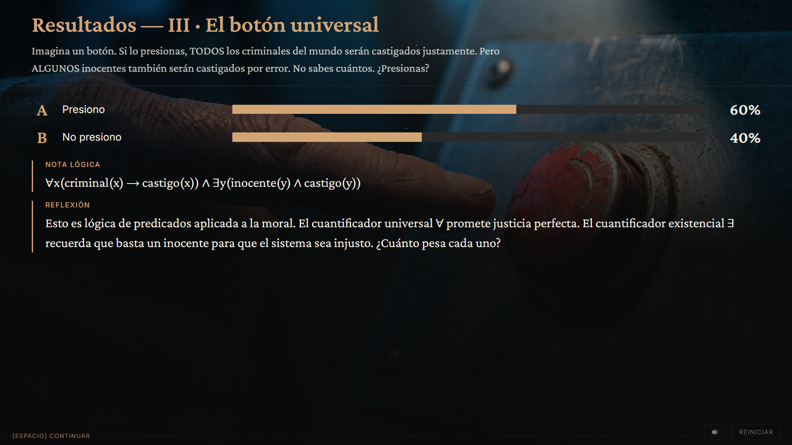
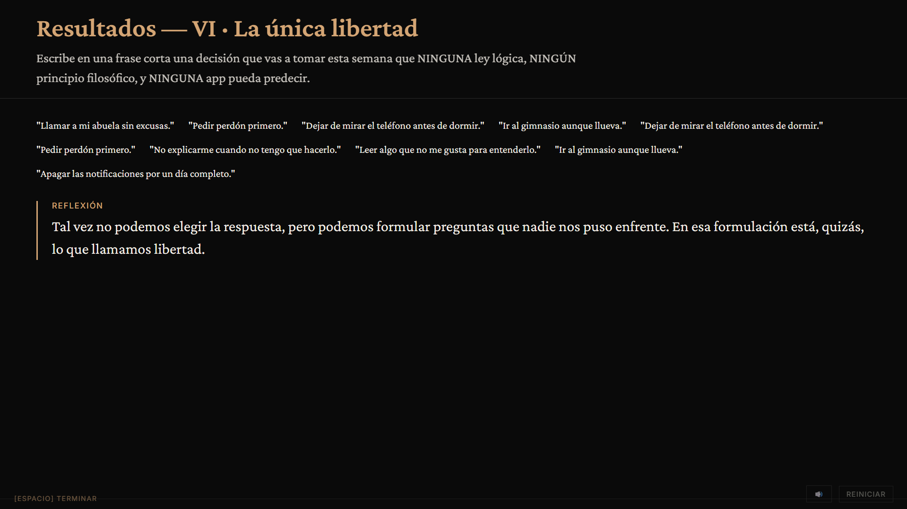
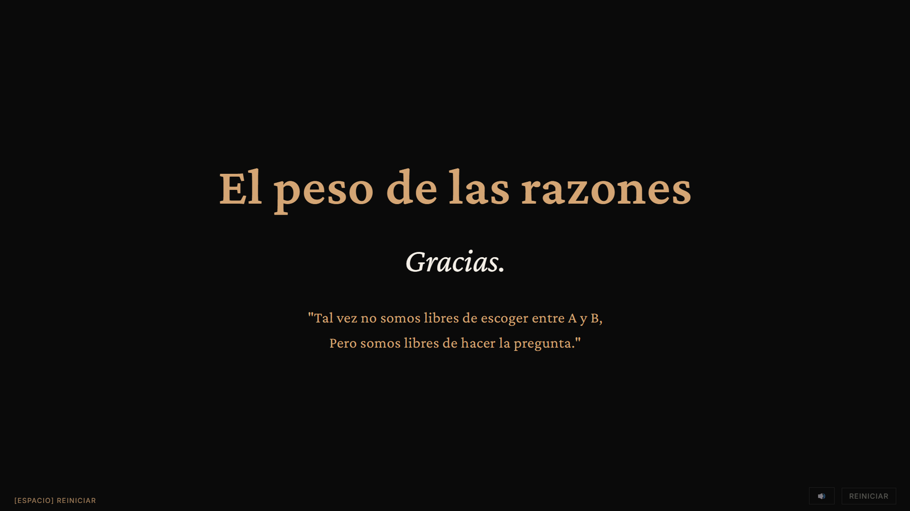

# El peso de las razones




App web interactiva para exposiciones de Matemáticas para la Informática.
Una pantalla actúa como proyector; los estudiantes se conectan desde sus celulares
escaneando un QR para votar dilemas filosóficos en tiempo real.

---

## Galería


*Dilema I — El tranvía. Cada dilema combina enunciado, imagen y timer.*


*Antes del dilema 5, la app predice cómo votará el salón basándose en los votos previos.*


*Cada dilema cierra con resultados, fórmula lógica y reflexión filosófica.*


*Dilema VI — La única libertad. Texto libre, sin opciones predefinidas.*


*Cierre de la exposición.*

---

## Video demo

[Ver demo en YouTube](https://youtu.be/Cej322_aPpo)

---

## Instalación

```bash
python -m venv .venv
source .venv/bin/activate   # Linux / WSL / Mac
pip install -r requirements.txt
```

---

## Correr el servidor

```bash
python app.py
```

Al arrancar verás en consola:

```
============================================================
  El peso de las razones — Servidor de exposición
============================================================
  Proyector : http://localhost:5000/proyector
  Jugadores : http://<IP_LOCAL>:5000/jugador
============================================================
```

Abrí `http://localhost:5000/proyector` en el navegador del proyector.
Los celulares escanean el QR o navegan directamente a la URL de jugadores.

---

## URLs de acceso

| Rol | URL |
|---|---|
| Proyector | `http://localhost:5000/proyector` |
| Estudiantes | `http://<IP>:5000/jugador` |
| Presentador (cel) | `http://<IP>:5000/jugador?p=1` |

El presentador puede avanzar la pantalla de resultados presionando **ESPACIO** en el
proyector, o con el botón **▶ AVANZAR** que aparece en su celular al entrar con `?p=1`.

---

## Configuración

Copiá `.env.example` a `.env` y editalo según necesites:

```bash
cp .env.example .env
```

| Variable | Descripción | Default |
|---|---|---|
| `IP_OVERRIDE` | IP que aparece en el QR. Ver sección WSL abajo. | auto-detect |
| `URL_OVERRIDE` | URL pública completa (ngrok u otro túnel). Si está definida, sobrescribe `IP_OVERRIDE`. | vacío |
| `DILEMA_DURACION` | Segundos de votación por dilema | `30` |

En lugar de editar `.env` a mano, podés usar el script interactivo (recomendado el día de la presentación):

```bash
python setup_red.py
```

---

## Nota sobre WSL

Cuando corrés el servidor desde WSL, la IP detectada automáticamente (`172.x.x.x`) es
la de la interfaz virtual de WSL, **no la de la tarjeta Wi-Fi de Windows**. Los celulares
en la misma red no van a llegar a esa IP.

`setup_red.py` resuelve esto automáticamente: llama a `ipconfig.exe` desde WSL, lista
todas las IPs reales de Windows junto a las de Linux, y actualiza `IP_OVERRIDE` en `.env`.

Si los celulares siguen sin conectar después de elegir la IP correcta, probablemente sea
el firewall de Windows. Habilitá el puerto en PowerShell (como administrador):

```powershell
New-NetFirewallRule -DisplayName "Flask 5000" -Direction Inbound -Protocol TCP -LocalPort 5000 -Action Allow
```

---

## 🎯 Día de la presentación

### Antes de empezar (5-10 minutos antes)

1. Decidí qué red vas a usar (ver planes abajo).
2. Ejecutá `python setup_red.py` y elegí la IP correspondiente.
3. Reiniciá el servidor: `python app.py`.
4. **Probá desde un celular** que la URL funcione antes de empezar.

---

### Plan A — WiFi del salón

Usalo si: la WiFi del lugar es confiable y permite que los dispositivos se vean entre sí
(sin AP isolation).

1. Conectá el PC al WiFi del salón.
2. Ejecutá `python setup_red.py` y elegí la IP del adaptador Wi-Fi.

> ⚠️ Algunas WiFi universitarias tienen AP isolation activado, lo que bloquea la
> comunicación entre dispositivos. Si el celular no llega al PC, pasá al Plan B.

---

### Plan B — Hotspot del celular (recomendado)

No depende del WiFi del lugar. Es la opción más confiable para exposiciones.

1. Activá el hotspot de tu celular con nombre y contraseña simples (ej. `peso-razones` / `12345678`).
2. Conectá el PC a ese hotspot.
3. Ejecutá `python setup_red.py` y elegí la IP del adaptador del hotspot.
4. Antes de empezar, dictale al salón el nombre y contraseña de la red.

> ⚠️ La mayoría de celulares limita el hotspot a 8-10 dispositivos. Si son más
> estudiantes, considerá el Plan A o el Plan C.

---

### Plan C — Ngrok (recomendado cuando se requieren más de 8 conexiones o la WiFi del lugar tiene AP isolation)

Ngrok crea un túnel desde internet a tu Flask local. La URL pública funciona desde cualquier
red (datos móviles, otras WiFi). El QR del proyector apunta directamente a esa URL, sin
necesidad de dictarla al salón.

**Instalación de ngrok** (una sola vez):
```bash
# Linux/WSL — instalar via apt
curl -sSL https://ngrok-agent.s3.amazonaws.com/ngrok.asc \
  | sudo tee /etc/apt/trusted.gpg.d/ngrok.asc >/dev/null \
  && echo "deb https://ngrok-agent.s3.amazonaws.com buster main" \
  | sudo tee /etc/apt/sources.list.d/ngrok.list \
  && sudo apt update && sudo apt install ngrok

# Configurar tu authtoken (sacalo en https://dashboard.ngrok.com/get-started/your-authtoken)
ngrok config add-authtoken <TU_TOKEN>
```

**Uso el día de la presentación**:

1. En una terminal, levantá Flask normalmente:
   ```bash
   python app.py
   ```

2. En otra terminal, levantá ngrok:
   ```bash
   ngrok http 5000
   ```

3. Copiá la URL pública que aparece en la línea `Forwarding`, algo tipo:
   ```
   https://parched-humbly-marbles.ngrok-free.dev
   ```

4. Editá `.env` y pegala como `URL_OVERRIDE`:
   ```
   URL_OVERRIDE=https://parched-humbly-marbles.ngrok-free.dev
   ```

5. Reiniciá Flask (Ctrl+C y volvé a correr `python app.py`).

6. Recargá el proyector en el navegador (Ctrl+Shift+R). El QR ahora apunta directamente
   a la URL de ngrok, y los estudiantes pueden escanearlo con datos móviles o cualquier red.

> ⚠️ **La URL cambia cada vez que reiniciás ngrok** (en el plan gratuito). Si reiniciás
> ngrok, hay que actualizar el `.env` y reiniciar Flask.

> ⚠️ La primera vez que un estudiante entra a la URL, ngrok muestra una página de
> advertencia. Hay que tocar "Visit Site" para continuar. Avisarles al salón al inicio
> de la exposición.

---

### Solución de problemas

**El QR apunta a una IP incorrecta.**
→ Corriste `setup_red.py` pero no reiniciaste `app.py`. Reinicialo.

**El celular muestra "no se puede acceder" o se queda cargando.**
→ El celular no está en la misma red que el PC. Verificá que ambos estén en el mismo
WiFi o hotspot.

**Solo algunos celulares conectan, otros no.**
→ El hotspot llegó al límite de conexiones. Considerá el Plan C como respaldo.

---

## Verificar el flujo completo

Con el servidor corriendo, podés simular un proyector y un jugador desde el REPL de Python:

```python
import socketio, time

proyector = socketio.SimpleClient()
proyector.connect("http://localhost:5000")

jugador = socketio.SimpleClient()
jugador.connect("http://localhost:5000")

jugador.emit("jugador:conectar")
print("Bienvenida:", jugador.receive(timeout=2))

proyector.emit("proyector:iniciar_partida")
time.sleep(1)

jugador.emit("jugador:votar", {"opcion": "A"})
print("Estado tras voto:", jugador.receive(timeout=2))

proyector.emit("proyector:reset")
proyector.disconnect()
jugador.disconnect()
```

Requiere `pip install "python-socketio[client]"` en el entorno donde corras el script.

Para verificar que las rutas HTTP responden:

```bash
curl -s -o /dev/null -w "%{http_code}" http://localhost:5000/proyector  # → 200
curl -s -o /dev/null -w "%{http_code}" http://localhost:5000/jugador    # → 200
curl -s -o /dev/null -w "%{http_code}" http://localhost:5000/           # → 302
```

---

## Estructura del proyecto

```
peso-razones/
├── app.py              # Servidor Flask + SocketIO + rutas
├── game_state.py       # Estado del juego
├── dilemas.py          # Lista de dilemas
├── fake_players.py     # Jugadores simulados para pruebas
├── setup_red.py        # Configurador de red interactivo (usar el día de la expo)
├── .env.example        # Plantilla de variables de entorno
├── requirements.txt
├── static/
│   ├── css/
│   │   ├── proyector.css
│   │   └── jugador.css
│   ├── js/
│   │   ├── proyector.js
│   │   └── jugador.js
│   ├── img/            # Imágenes de los dilemas
│   └── sounds/         # Efectos de sonido (.mp3)
└── templates/
    ├── proyector.html
    ├── jugador.html
    └── admin_prueba.html
```
